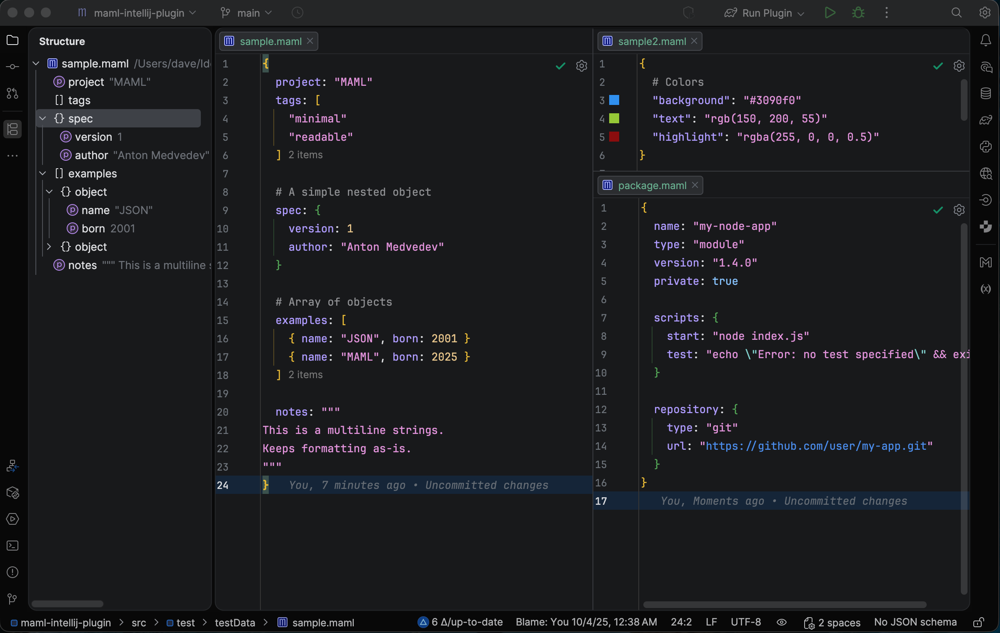

## MAML IntelliJ Plugin


## Description

<!-- Plugin description -->
A plugin for JetBrains IDE's providing comprehensive language support for MAML (Minimal Abstract Markup Language) files.

### Core Features
- Syntax Highlighting
- Code Intelligence with JSON Schema support
- Code Inspections for schema compliance and common issues
- Refactoring support including smart key renaming and string conversions
- Structure View for easy navigation
- Editor enhancements like smart quotes, brace matching, and block commenting
- Customizable settings for folding, inspections, and color schemes

<!-- Plugin description end -->



## Features

### Syntax Highlighting
- Full syntax highlighting for MAML syntax including:
  - Objects with braces `{ }`
  - Arrays with brackets `[ ]`
  - Quoted and Unquoted keys
  - string values with escape sequences
  - Multiline strings with triple quotes `"""`
  - Numbers (integers, floats, scientific notation)
  - Booleans (`true`, `false`)
  - Null values (`null`)
  - Separators (commas and newlines)
  - Comments (line comments with `#`)

### Code Intelligence
- **JSON Schema Support**: Automatic schema-based completions and validation
- **Documentation**: Inline documentation from JSON schemas
- **Code Folding**: Collapse and expand objects, arrays, and multiline strings
- **URL and File Path Recognition**: Clickable links for URLs and file paths

### Inspections
- Schema compliance validation
- Duplicate key detection with quick fixes
- Invalid escape sequence detection
- Invalid identifier key validation

### Refactoring
- **Smart Key Renaming**: Rename keys  with automatic detection of duplicate key conflicts
- **String Conversions**: Convert between single-line and multiline strings

### Structure View
- Hierarchical view of MAML document structure
- Visual icons for objects, arrays, and properties
- Quick navigation to elements

### Editor Features
- Smart quote handling for strings
- Brace matching and auto-completion
- Block commenting with `#`
- Reference support for file paths and URLs
- Color picker gutter icon for hex, rgb, and rgba color values

### Settings
- Code folding preferences
- Toggle inspections on/off
- Customizable color scheme for syntax elements

## MAML Language Overview

MAML is a JSON-like configuration format with a cleaner syntax:

```maml
{
  project: "MAML"
  tags: [
    "minimal"
    "readable"
  ]

  # A simple nested object
  spec: {
    version: 1
    author: "Anton Medvedev"
  }

  # Array of objects
  examples: [
    { name: "JSON", born: 2001 }
    { name: "MAML", born: 2025 }    
  ]

  notes: """
This is a multiline strings.
Keeps formatting as-is.
"""
}
```

## Installation

> [!NOTE]  
> Coming soon!

1. Download the plugin from the JetBrains Marketplace
2. Install via: **Settings** → **Plugins** → **Marketplace** → Search for "MAML"
3. Restart IntelliJ IDEA

## Development

### Building the Plugin

```bash
# Build the plugin
./gradlew buildPlugin

# Run the plugin in a sandbox IDE
./gradlew runIde

# Run tests
./gradlew test

# Verify plugin compatibility
./gradlew verifyPlugin
```

### Project Structure

```
src/main/
├── kotlin/com/davidseptimus/maml/
│   ├── lang/               # Language core (parser, lexer, PSI)
│   ├── highlighting/       # Syntax highlighting
│   ├── editor/            # Editor features (folding, commenting)
│   ├── annotators/        # Error highlighting
│   ├── inspections/       # Code inspections
│   ├── intentions/        # Quick fixes and intentions
│   ├── refactoring/       # Rename and refactoring support
│   ├── structure/         # Structure view
│   ├── json/              # JSON Schema integration
│   └── settings/          # Plugin settings
└── resources/
    └── META-INF/plugin.xml
```

### Grammar Files

- **Parser**: `src/main/kotlin/com/davidseptimus/maml/lang/MamlParser.bnf`
- **Lexer**: `src/main/kotlin/com/davidseptimus/maml/lang/MamlLexer.flex`

After modifying the grammar, regenerate the parser using IntelliJ's **Generate Parser Code** action.
